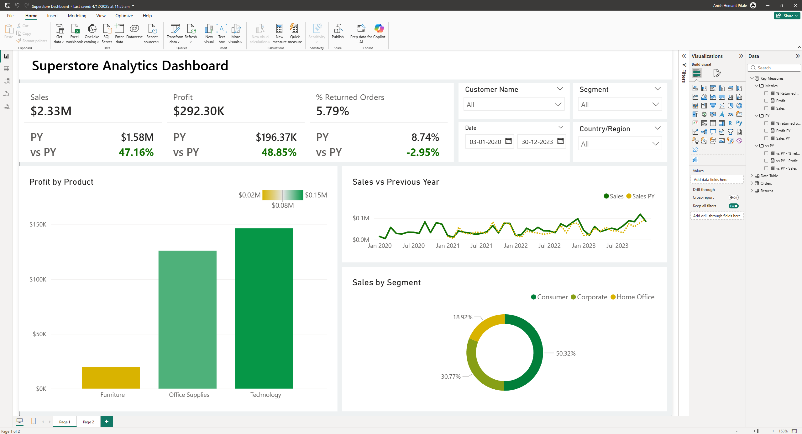

📊 **Superstore Sales Analytics Dashboard (Power BI)**

This project presents an end-to-end **Power BI dashboard** built using the Superstore dataset to analyze Sales, Profit, and Returned Orders across multiple years.  
The dashboard provides dynamic insights by customer segment, product category, region, and date, enabling users to compare performance with the previous year using YoY metrics.

🚀 **Project Overview**
This dashboard answers key business questions such as:

* Which product categories and segments contribute the most sales and profit?
* What percentage of orders are being returned?
* How did Sales and Profit perform compared to the previous year?
* Which customer segments drive business performance?
* What trends can be seen across time, categories, and geographies?

🗂️ **Dataset Source**
Public Superstore dataset:  
https://www.kaggle.com/datasets/vivek468/superstore-dataset-final

🔧 **Tech Stack**

* Power BI Desktop
* Power Query
* DAX
* Excel / CSV Dataset
* Data Modeling

⭐ **Dashboard Features**

* KPI Cards (Sales, Profit, % Returned, YoY Metrics)
* Sales vs Previous Year (Line Chart)
* Profit by Category
* Sales by Segment
* Interactive slicers (Customer, Segment, Region, Date)

📊 **Key Insights**

* Technology category generates the highest profit.
* Consumer segment contributes the most sales.
* Seasonal sales patterns observed across years.
* Return rate remains low but measurable.

🧠 **DAX Measures Used**
**Core KPIs**

Profit = SUM(Orders\[Profit])
Sales = SUM(Orders\[Sales])

**Return Rate**

% Returned Orders =
VAR \_total\_orders = DISTINCTCOUNT(Orders\[Order ID])
VAR \_returned\_orders = DISTINCTCOUNT(Returns\[Order ID])
RETURN DIVIDE(\_returned\_orders, \_total\_orders)

**Time Intelligence**

% Returned Orders PY =
CALCULATE(\[% Returned Orders], SAMEPERIODLASTYEAR('Date Table'\[Date]))

Profit PY = CALCULATE(\[Profit], SAMEPERIODLASTYEAR('Date Table'\[Date]))
Sales PY  = CALCULATE(\[Sales], SAMEPERIODLASTYEAR('Date Table'\[Date]))

**Variance vs Previous Year**

vs PY - % Returned Orders = \[% Returned Orders] - \[% Returned Orders PY]; 
vs PY - Profit = DIVIDE(\[Profit] - \[Profit PY], \[Profit PY]); 
vs PY - Sales  = DIVIDE(\[Sales] - \[Sales PY], \[Sales PY])

🎯 **Purpose:**
Demonstrates BI dashboard building, data modeling, DAX, and analytics storytelling for portfolio and job applications.

